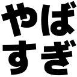
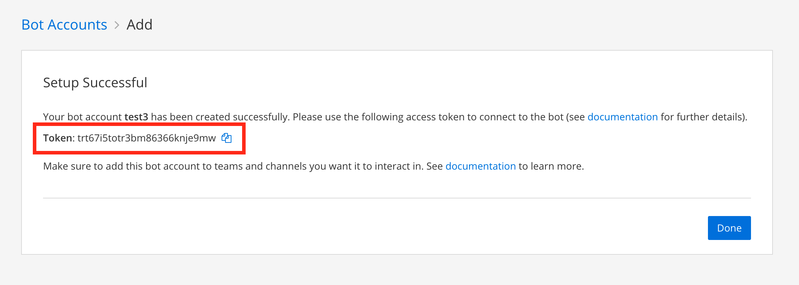
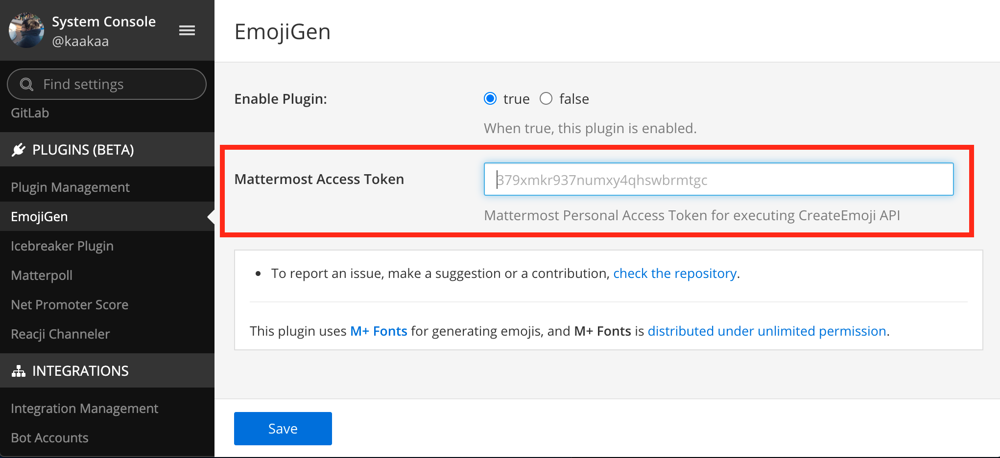
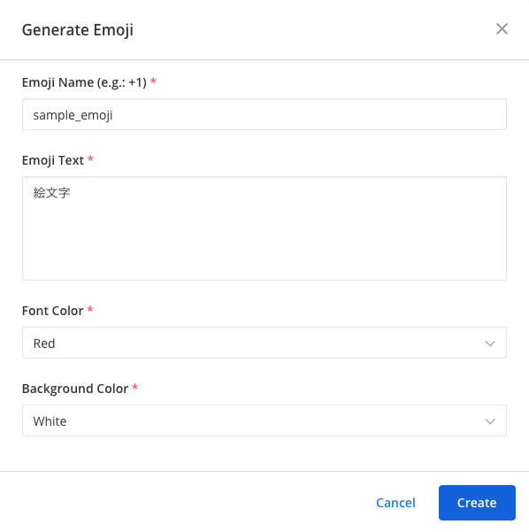

[](https://circleci.com/gh/kaakaa/mattermost-emojigen/tree/master)

# Mattermost EmojiGen

Mattermost plugin for generating custom emoji.



## Set up

Mattermost EmojiGen plugin needs [personal access token](https://docs.mattermost.com/developer/personal-access-tokens.html) to create emojis via Mattermost REST API. We recommend creating bot account, and using access token of the bot.

### 1. Create bot account

1. Create bot account from **Main Menu > Integrations > Bot Accounts**
   - https://docs.mattermost.com/developer/bot-accounts.html#bot-account-creation
2. Copy the Access Token that is displayed when the bot account creation is completed
   - Copied token will be used in step `2-3`



### 2. Install plugin

1. Download a plugin distribution from [Releases · kaakaa/mattermost\-emojigen](https://github.com/kaakaa/mattermost-emojigen/releases/lateset)
2. Upload and enable plugin **System Console > Plugin > Plugin Management**
3. Set access token (copied in `1-2`) in plugin settings page



## Usage

You can generate emojis by slash command (`/emojigen`) or interactive dialog. Multi line emoji can be created by only emoji dialog.

### Simple Emoji

1. Executing `emojigen` command

```
/emojigen yabasugi やばすぎ
```

2. Use emoji (e.g.: `:yabasugi:`)

### Colored Emoji

You can specify font-color and background-color of emoji. Available colors are Black, Red, Green, Blue, White.

```
/emojigen yabasugi やばすぎ Red Blue
```

### Emoji dialog

```
/emojigen
```



## Development

### Building

```
make dist
```

# License

- This plugin is distributed under [MIT LICENSE](LICENSE)
- This plugin uses [**M+ Fonts**](https://mplus-fonts.osdn.jp/) for generating emojis. **M+ Fonts** is distributed under [LICENSE](./assets/ttf/mplus/LICENSE_E).
