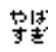
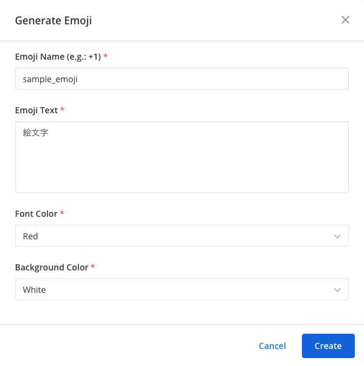

[](https://circleci.com/gh/kaakaa/mattermost-emojigen/tree/master)

# Mattermost EmojiGen

Mattermost plugin for generating custom emoji.



## Set up

### Plugin
1. Download a plugin distribution from [Releases · kaakaa/mattermost\-emojigen](https://github.com/kaakaa/mattermost-emojigen/releases)
2. Upload and Enabling plugin from your mattermost's admin console
3. Set your Mattermost Personal Access Token in configuration page on admin console

## Usage

### Simple Emoji
1. Executing `emojigen` command
```
/emojigen yabasugi やばすぎ
```
2. Use emoji (e.g.: `:yabasugi:`)

### Color Emoji
You can specify font-color and background-color of emoji. Available colors are Black, Red, Green, Blue, White.

```
/emojigen yabasugi やばすぎ Red Blue
```

### Emoji dialog
```
/emojigen
```



## Development

### Building

```
make dist
```

# License

* This plugin is distributed under [MIT LICENSE](LICENSE)
* This plugin uses [**M+ Fonts**](https://mplus-fonts.osdn.jp/) for generating emojis. **M+ Fonts** is distributed under [LICENSE](./assets/ttf/mplus/LICENSE_E).